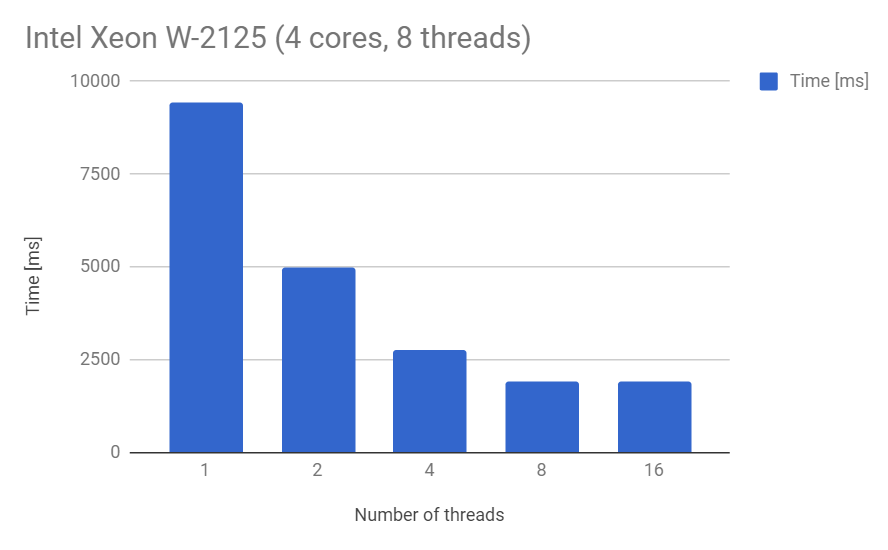

# raytracingthenextweek fork with multi-threading

This is a fork of code accompanying the book [Ray Tracing The Next Week by Peter Shirley](https://twitter.com/Peter_shirley/status/985561344555417600). 

Raytracing is a great candidate for speeding up using parallel processing because each pixel can be calculated independently of others (and we have a huge number of pixels to process). To parallelize the raytracing task, essentially no changes have to be done to algorithm itself - we only need to run it in parallel on multiple threads for different pixels and store results to appropriate positions in target buffer. 

Note that parallelizing ray tracing itself is a different task from parallelizing other algorithms needed to make a complete renderer - most notably building an acceleration structure (such as BVH) which gets much more complicated.

Tile-based approach to paralellization means that screen is subdivided into regular grid of tiles and each thread processes whole tile of pixels rather than single pixel or ray. You can experiment with different tile sizes to see how and if it affects the performance - I'd suggest starting with 16x16 or 32x32 pixels. Extra work that needs to be done for each tile such as figuring out tile screen coordinates and storing result to output (buffer or screen) is minimized with larger tiles - but larger tiles can cause underutilization of CPU cores in case one large tile takes much longer to render than others (such as when rendering a mirror). As a solution you can start with smaller tiles in the first place or try breaking down such tile into smaller ones and using idle threads to render it again.

Another advantage of tiled approach is that rays spatially close to each other are likely to access same data from main memory which gets cached speeding up calculation for subsequent rays within a tile - this is especially true for primary rays cast from camera. However, some CPU caches are shared between cores and threads are likely to render neighboring tiles anyway so this itself might not achieve speedup.

## Implementation

C++11 made paralellization easy by adding thread support into standard library and that's what we're using here. We start by spawning desired number of threads. Creating a thread itself takes time and there is no point in creating new thread for each tile. There will be hundreds or thousands of tiles (and threads) so they wouldn't be executed in parallel anyway. Generally it is best to have as many threads as we have CPU cores - but you can experiment with number of threads to see how it affects performance. 

> Hint on number of threads supported can be obtained by call to `std::thread::hardware_concurrency()` function.

After thread has finished working on a tile we reuse it for another tile until whole screen has been processed.

Each thread starts by figuring out which tile to render:


```cpp		
// Use mutex to access shared information about next tile to render
tileInfoMutex->lock();

// Get next tile screen position from shared variables
int tileX = *nextTileX;
int tileY = *nextTileY;

// Advance to next tile
*nextTileX += tileWidth;

// Handle screen borders
if (*nextTileX >= nx) {
	// Advance to next line
	*nextTileX = 0;
	*nextTileY += tileHeight;
}

tileInfoMutex->unlock();

// Terminate raytracing when we go beyond screen borders
if (tileY >= ny) return;

// Clip tile to screen borders
tileWidth = tileWidth - intmax(0, tileX + tileWidth - nx);
tileHeight = tileHeight - intmax(0, tileY + tileHeight - ny);
```

This code section must be protected by a mutex to avoid multiple threads starting to work on the same tile. Mutex is an object that can be locked/unlocked and allows only one thread to enter given code section at the same time. We use two variables  `nextTileX` and `nextTileY` shared between threads to hold screen position of tile to be rendered next. Each thread will read these and advance them to next tile so following thread will start working on another tile.

After all tiles have been rendered the threads terminate execution and program exits.

Looking at the code there are following changes (**see main.cc file**):

- Main rendering loop has been moved out of `main` function into `rayTrace` function - this will be executed by each thread in a loop until all screen tiles have been rendered
- `rayTrace` function starts with a mutex protected section to figure out what tile to render
- Rendering loop only processes part of screen specified by given tile (care needs to be taken to clip tile boundaries to screen so we won't try to raytrace outside of frame potentially causing segmentation fault) 
- Output is stored to a dedicated buffer (a byte array) - former approach of outputing color values into console won't work anymore because tiles are processed out of order and at the same time
- `main` function now spawns threads for raytracing and waits for them to finish (calling join function on each thread) 
- performance measurement has been added using `std::chrono` utilities 

## Speedup

Using a CPU that support 8 HW threads we get linear speedup using 1-8 threads for raytracing - this is great! 16 threads and more do not achieve any more speedup as expected.




  


